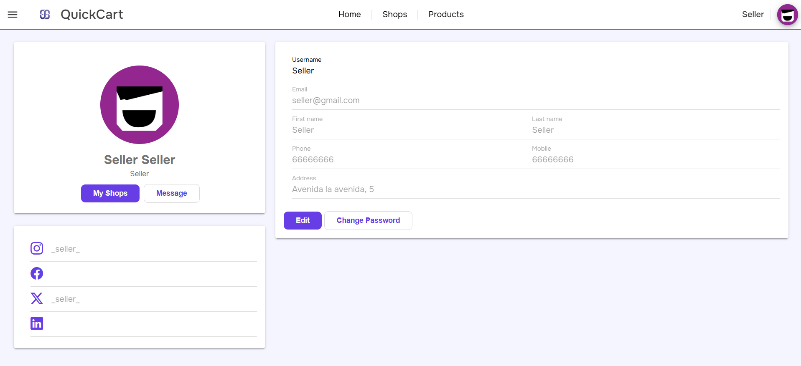
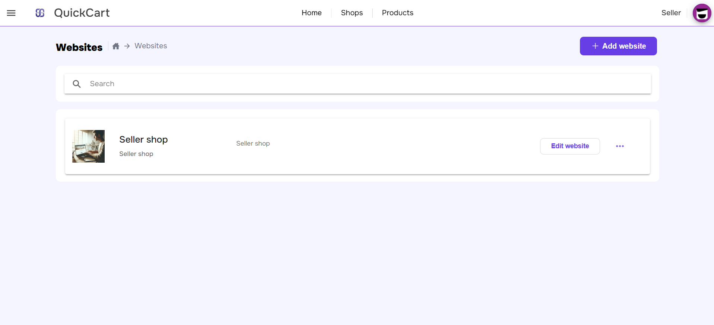
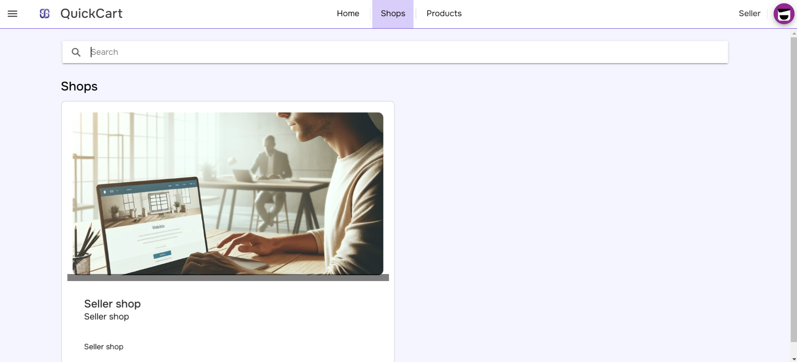

# MEMORIA FINAL
***

<right>

***Autor/es:***  
+ Alejandro Pérez Martín
+ Raúl González Martín
+ Javier García Domínguez

***Fecha:***  10-05-2024

***Tutor:*** Alejandro Martín Zarza

</right>

# INDICE 

1. [***INTRODUCCIÓN.***](#id1)
2. [***TECNOLOGÍAS UTILIZADAS.***](#id2)
3. [***GUIA DE ESTILO DE LA WEB.***](#id3)
4. [***INVESTIGACIÓN.***](#id4)
5. [***DERECHOS DE AUTOR.***](#id5)
6. [***RIESGOS Y MEDIDAS.***](#id6)
7. [***GRADO DE CUMPLIMIENTO EN ALCANCE.***](#id7)
8. [***GRADO DE CUMPLIMIENTO EN TIEMPO.***](#id8)
9. [***GRADO DE CUMPLIMIENTO EN COSTE.***](#id9)
10. [***PRODUCTO FINAL.***](#id10)
11. [***EXPEIRNECIAS APRENDIDAS A TENER EN CUENTA EN PRÓXIMOS PROYECTOS.***](#id11)
12. [***CONCLUSIONES, COMENTARIOS Y VALORACIÓN FINAL.***](#id12)

### 1. INTRODUCCIÓN. 

Muchas empresas de hoy en día aún no tienen página web debido a su bajo conocimiento de la programación o a que no se pueden permitir los costes de un programador que les realice dicha página web. Es aquí donde nace QuickCart, esta es una aplicación web en la que las empresas se podrán registrar y crear sus propias páginas web desde cero utilizando plantillas altamente personalizables, por lo que ninguna página web será igual.

### 2. TECNOLOGÍAS UTILIZADAS. 

+ Front End:
    - Angular con TypeScript
    - Ionic 7
    - Bootstrap 5.1
+ Back End:
    - Django 5 con Python
+ Base de datos:
    - SQLite

Estas tecnologías fueron necesarias tanto para la fase de desarrollo como para la producción.

En cuanto al hardware necesario, QuickCart no requiere de equipamiento adicional significativo, ya que se basa en servicios en la nube para su despliegue y operación.

### 3. GUIA DE ESTILO DE LA WEB. 

La guía de estilo de la web establece los estándares visuales y de experiencia de usuario que deben seguirse para mantener una apariencia coherente y profesional. En este proyecto, buscamos crear una aplicación web con un diseño lo más limpio posible y moderno. Los elementos clave de nuestra guía de estilo incluyen:

+ Colores: Se utilizaron tonos neutros como el blanco, y un color primario como el violeta para resaltar los elementos importantes y hacer una página única.
+ Fuentes: Se eligieron fuentes onest para mantener una legibilidad óptima.
+ Estructura: Las páginas están estructuradas con una navegación intuitiva y jerárquica.

### 4. INVESTIGACIÓN. 

Durante el desarrollo de QuickCart, se llevaron a cabo investigaciones para abordar diversas cuestiones técnicas y de diseño. Algunas áreas clave de investigación incluyeron:

+ Integración de tecnologías: Se investigó el como combinar Django y Angular en un solo proyecto.
+ Experiencia de usuario: Se realizaron estudios para mejorar la usabilidad de la aplicación.

No todo funcionó a la primera, algunos desarrollos tuvieron que ser modificados o descartados debido a problemas de dificultad y tiempo. Sin embargo, el proceso de investigación permitió encontrar soluciones adecuadas para los problemas encontrados.

### 5. DERECHOS DE AUTOR. 

En QuickCart, se utilizaron diversos tipos de contenido y recursos multimedia. Para garantizar el respeto a los derechos de autor, se implementaron las siguientes acciones:

+ Desarrollo propio: El logotipo de la aplicación fue creado internamente utilizando Photoshop. Este recurso está publicado bajo una licencia Creative Commons.
+ Material de terceros: Se utilizaron librerías como Google Fonts para la fuente y Ionic o Bootstrap para estilos e iconos. Ambos con licencias que permiten su uso para fines comerciales, sin restricciones de redistribución. También se han utilizado imagenes las cuales ninguna está bajo licencias por lo que son aptas para nuestros objetivos de uso.

### 6. RIESGOS Y MEDIDAS. 

Durante el desarrollo del proyecto, surgieron varios problemas, entre ellos:

+ Integración de funcionalidades: Hubo dificultades al integrar algunas funcionalidades a algunos componentes. Para mitigarlo, el equipo se ayudó al completo y se buscó información para arrelgar dicho error lo antes posible.
+ Cambios de estilo en componententes de Ionic: para arreglar este error tuvimos que investigar más a fondo como estilar dichos componentes.
+ Desviación de tiempos: Algunos módulos tardaron más de lo esperado. Para evitar mayores retrasos, se ajustaron las tareas prioritarias y nos ayudamos entre los integrantes del equipo para sacar adelante esos problemas.

### 7. GRADO DE CUMPLIMIENTO EN ALCANCE. 

El proyecto logró cubrir la mayoría de las funcionalidades proyectadasSin embargo, algunas funciones secundarias tuvieron que ser postergados para futuras actualizaciones debido a restricciones de tiempo. Las funcionalidades implementadas incluyen:

+ Gestión de cuentas: Registro, inicio de sesión y edición de perfiles.
+ Gestión de tiendas: Empresas pueden gestionar los productos, las webs de las tiendas para la visualizacion de productos.
+ Gestión del carrito: Clientes pueden agregar productos, ajustar cantidades y eliminar elementos.
+ Barra de búsqueda: Búsqueda por empresas.
+ Sistema de pago: Los clientes pueden pagar los productos mediante Stripe, un intermediario entre el cliente y la empresa, la cual gestiona los pago y las cuentas.

Algunas funciones secundarias, como las valoraciones de los productos, quedaron fuera del alcance inicial pero se planean para futuras actualizaciones.

### 8. GRADO DE CUMPLIMIENTO EN TIEMPO. 

El proyecto se completó dentro del plazo, aunque hubo algunos retrasos en etapas específicas. La planificación inicial era estimada de 78 días para el desarrollo, pero algunas partes tomaron más tiempo debido a problemas técnicos y la complejidad de la integración. Sin embargo, mediante ajustes y priorización de tareas, se logró cumplir con la fecha de entrega final.

### 9. GRADO DE CUMPLIMIENTO EN COSTE. 

El proyecto se mantuvo dentro del presupuesto previsto de **6.427€**. Para evitar desviaciones de costo, se llevaron a cabo revisiones regulares y se ajustaron ciertos elementos para reducir gastos. El control de versiones y la colaboración efectiva ayudaron a minimizar errores y retrasos, manteniendo los costos bajo control.

### 10.  CLAUSULAS. 

En el contrato del proyecto, se especificaron las siguientes cláusulas clave:

+ Retrasos: Se acordó un período de 2 meses para retrasos no previstos, con multas en caso de superación significativa.
+ Pagos: Los pagos serán realizados por Stripe, un intermediario que nos ayuda a gestionar los pagos y todas las cuentas.

### 11.  PRODUCTO FINAL. 

QuickCart es una plataforma de comercio electrónico que permite a las empresas crear y gestionar sus propias tiendas en línea. El sistema ofrece una gama de funcionalidades clave para facilitar la venta de productos:

+ Gestión de cuentas: Registro, inicio de sesión y edición de perfiles.

+ Gestión de tiendas: Empresas pueden gestionar los productos, las webs de las tiendas para la visualizacion de productos.

.png)

+ Gestión del carrito: Clientes pueden agregar productos, ajustar cantidades y eliminar elementos.
***IMAGEN***
<!-- 

 -->

+ Barra de búsqueda: Búsqueda por empresas.

+ Sistema de pago: Los clientes pueden pagar los productos mediante Stripe, un intermediario entre el cliente y la empresa, la cual gestiona los pago y las cuentas.
***IMAGEN***
<!-- 

 -->
La implementación con Django y Angular garantiza un sistema estable y escalable. El despliegue en Azure facilita el mantenimiento y la escalabilidad.
    
### 12.  EXPERIENCIAS APRENDIDAS A TENER EN CUENTA EN PRÓXIMOS PROYECTOS. 

Durante el desarrollo de QuickCart, se aprendieron varias lecciones importantes:

+ Comunicación y colaboración: La comunicación constante en el equipo y el uso de GitHub para el control de versiones fue esencial para el éxito del proyecto.
+ Planificación flexible: Mantener una planificación flexible permitió ajustar el cronograma para compensar retrasos inesperados.
+ Organización: Mantener el proyecto organizado de una manera fácilmente entendible para que en el desarrollo de la aplicación no se hagan difíciles tareas que deberían ser fáciles.

Estas experiencias nos servirán para futuros proyectos, permitiendonos mejorar la planificación y la ejecución del desarrollo.

### 13.  CONCLUSIONES, COMENTARIOS Y VALORACIÓN FINAL. 

El proyecto de QuickCart ha sido un éxito, el equipo ha logrado los objetivos propuestos y se ha conseguido realizar una aplicación funcional siguiendo la misma idea que se tenía desde el principio. Aunque en el desarrollo del proyecto se presentaron numerosos problemas como la integración de algunas funcionalidades o la desviación de tareas debido a que el tiempo para finalizar el proyecto era bastante limitado.
En cuanto al equipo, este se encuentra más que satisfecho con el resultado obtenido de la aplicación, y piensa que añadiendo sus debidas actualizaciones para completar así todas las ideas pensadas para el desarrollo, QuickCart podría ser una herramienta valiosa para aquellas empresas que busquen expandirse o digitalizarse pero no tengan los conocimientos suficientes. A lo largo de el desarrollo de la aplicación hemos adquirido ciertas experiencias que nos ayudarán en un futuro no muy lejano a mejorar procesos y el enfoque a la hora de desarrollar una aplicación.