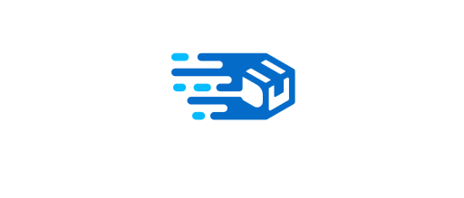

# ANTEPROYECTO PARA SOLICITAR LA REALIZACIÓN DEL MÓDULO
# PROYECTO

## Indice

1. [IDENTIFICACIÓN](#id1)
2. [OBJETIVOS](#id2)
3. [PREANÁLISIS DE LO EXIXTENTE](#id3)
4. [PRE-ANÁLISIS DEL SISTEMA](#id4)
5. [PRE-DISEÑO DEL SISTEMA](#id5)
6. [ESTIMACIÓN DE COSTES](#id6)

 

### 1. IDENTIFICACIÓN 

+ Nombre del proyecto: QuickCart
+ Alumnos:
  - Alejandro Pérez Martín
  - Raúl González Martín
  - Javier García Domínguez
+ Curso: 2º Desarrollo de Aplicaciones Web
+ Tutor: Alejandro Martín Zarza

### 2. OBJETIVOS 
Este proyecto pretende acercar grandes o pequeñas a empresas a la población de todo el país, haciendo que puedan vender sus productos de primera mano, no importa el producto,
siempre y cuando no sean seres vivos. Esta aplicación estará pensada también para los pueblos y ciudades más alejados de los continentes, así como, Las Islas Canarias o Cabo Verde ya que se permitirán
envíos a estos lugares, los cuales sufren de muchos problemas para el envío de productos.

### 3. PREANÁLISIS DE LO EXISTENTE 
Este mercado está liderado por grandes multinacionales así como, Amazon, Ebay o Wallapop, por lo que es difícil destacar ante ellos, es por eso por lo que nosotros pretendemos cambiar un poco el sentido del mercado. Nuestra intención es ayudar al comercio local de nuestro país, así ayudaríamos a la economía tanto provincial como nacional. 

### 4. PRE-ANÁLISIS DEL SISTEMA 
Los requisitos que nuestro equipo está dispuesto a satisfacer para el cliente son los siguientes:
  - Gestión de cuentas $\rightarrow$ Inicio de sesión/Registrar/Editar perfil
  - Gestión de productos $\rightarrow$ Productos/Categorías/Reviews
  - Gestión del carrito $\rightarrow$ Aumentar cantidad de un mismo producto, eliminar producto de carrito, etc.
  - Barra de búsqueda por productos o empresas

### 5. PRE-DISEÑO DEL SISTEMA 

  En este proyecto, utilizaremos Django con Python y Laravel con PHP como frameworks de backend, junto con PostgreSQL como sistema de gestión de bases de datos. Para la aplicación cliente, optaremos por React con TypeScript, brindando así un entorno de desarrollo estructurado y tipado para una mejor mantenibilidad del código.

  El proceso de desarrollo se llevará a cabo bajo las mejores prácticas de control de versiones, utilizando GitHub como plataforma central para la colaboración y la gestión de código fuente. Esto permitirá un flujo de trabajo colaborativo, así como una adecuada gestión de cambios y versiones del código.

  En cuanto al despliegue del sistema, tenemos pensado utilizar las máquinas virtuales de Azure. Ya que ofrece una amplia gama de servicios y herramientas que facilitan el despliegue y la gestión de la infraestructura.

  También se ha tenido en cuenta el hardware necesario y se ha contemplado que no necesitaremos hardware adicional por el momento, el único coste extra el cual ha sido la maquina virtual para el despliegue ya ha sido tomado en cuenta y está especificado en el desglose de costos totales.

### 6. ESTIMACIÓN DE COSTES 

#### 6.1 ESTIMACIÓN TEMPORAL

  Este proyecto tomará en su totalidad 78 días, siendo un total de 156 horas de trabajo aproximadamente por componente. Comenzando el 4 de marzo y finalizando el 21 de mayo.  Se comenzará por  la creación del anteproyecto con fecha límite el 4 de marzo.

  Después se continuará con el análisis y posterior diseño de la aplicación desde el 6 de marzo hasta el 9 de ese mismo mes. En este apartado se crearán diferentes diagramas. S realizarán los diagramas de casos de uso, de clases y el modelo de Entidad-Relación de la base de datos. Así tambien empezando y finalizando el diseño de los modelos para dar paso a la siguiente etapa.

  Seguidamente comenzará la etapa de codificación abarcando desde el 9 de marzo hasta el 17 de mayo. Esta está inicialmente dividida en diferentes apartados.

1) Backend/Servidor. Abarcando desde el 9 de marzo hasta el 6 de mayo. Este apartado al ser más amplio estará dividido en varios apartados.
   1. Backend en DJango: Desde el 9 de marzo
   2. Backend en Laravel

2) Aplicación cliente en React. Esta comenzará el 6 de abril y finalizará el 17 de mayo.

Testing. Este apartado se desarrollará a lo largo del periodo de codificación así que no se representa como un plazo fijo.

Y a partir del 17 de mayo hasta el 21 de ese mismo mes se realizará toda la documentación para la entrega de este proyecto.

#### 6.2 ESTIMACIÓN ECONÓMICA
Coste aproximado de la página web: **6.427€**

- Dominio y servidor:
  - Coste aproximado del dominio por 10 años $\rightarrow$ ~69.50€.
  - Coste aproximado del servidor por 10 años $\rightarrow$ ~390.00€.
- Redacción de textos:
  - Contrato de 75€/h con un plus de 0,60 €/palabra por cambio de idioma.
- Multimedia:
  - Licencias multimedia aproximadamente 300€.
- Marketing:
  - Emplearemos la técnica de optimización para Motores de Búsqueda (SEO), invertiremos aproximadamente 500€.
- Mantenimiento:
  - 300€ de mantenimiento (plus de 50 €/hora si supera la jornada de 8 horas).

